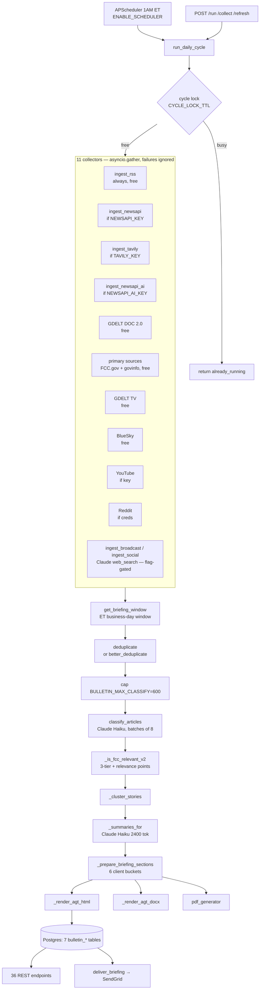

# 00 — Existing Architecture (as-built)

**Phase 0, read-only.** No code was modified. All statements below were verified against
the working tree and the live database on 2026-07-26.

---

## 1. Module inventory

`app/bulletin_intelligence/` — **31 Python files, 10,427 lines.**

| File | Lines | Role |
|---|--:|---|
| `engine.py` | **3,618** | The monolith: collectors, dedup, classify, cluster, render, email, archive |
| `routes.py` | 817 | 36 API endpoints |
| `bulletin_download_routes.py` | 702 | 4 export/download endpoints |
| `bulletin_store.py` | 488 | Postgres persistence, 7 tables, `CREATE TABLE IF NOT EXISTS` on startup |
| `scheduler.py` | 441 | APScheduler jobs, retry, weekend rule, alerting |
| `fcc_boolean_search.py` | 432 | `FCC_SEARCH_TOPICS` query bank |
| `fcc_feeds_extended.py` | 360 | Extended RSS feed list |
| `story_repository.py` | 259 | Story persistence + retention |
| `editorial_rules.py` | 236 | Client editorial rules |
| `coverage_hotfix.py` | 206 | `better_deduplicate` wrapper |
| `clustering.py` | 205 | Story clustering |
| `health_monitor.py` | 204 | Provider reachability probes |
| `provider_analysis.py` | 200 | Per-provider contribution analytics |
| `fcc_sources.py` | 187 | Source tiering (`MAJOR_DAILIES`, `WIRES`, `TRADES`, …) |
| `pws.py` / `pdf_generator.py` | 185 / 185 | Public-water-system coverage / PDF export |
| `editor_audit.py` | 169 | Editorial audit report |
| `gdelt_tv_ingest.py` | 167 | GDELT TV (broadcast captions) |
| `youtube_ingest.py` | 166 | YouTube collector |
| `bluesky_ingest.py` | 151 | BlueSky collector |
| `scoring.py` | 134 | Authority/recency/quality scoring |
| `fcc_social_accounts.py` | 129 | Social handles |
| `cspan_fcc_ingest.py` | 99 | C-SPAN collector |
| `gdelt_doc_ingest.py` | ~80 | GDELT DOC 2.0 |
| `reddit_ingest.py` | ~90 | Reddit collector |
| `boolean_filter.py` | ~14 (dense) | Section assignment by keyword |
| `test_bulletin_enhancements.py` | 273 | **The only test file in the backend** — 17 tests, all pass |
| `engine.py.backup` | — | Stale 62 KB backup, untracked risk |

Integration points outside the module (must not break): `app/main.py` (2 `safe_load` calls),
`app/core/email.py`, `app/api/admin_users.py` (module id), `app/Tefca/qa_monitor.py`.

---

## 2. Pipeline as actually wired



**The two Claude web-search collectors (`ingest_broadcast`, `ingest_social`) are gated on
`agency.include_broadcast` / `include_social`. `ingest_news` — the original Claude
discovery path — is explicitly commented out** at `engine.py:3113-3114`:

```python
# Claude web_search ingest_news disabled — too noisy/expensive
# tasks.append(ingest_news(agency, lookback_hours))
```

---

## 3. Where Claude is used today

| Site | Function | Model | Tokens | Status |
|---|---|---|--:|---|
| `engine.py:1543` | `ingest_news` (web_search) | haiku-4-5 | 2000 | **DISABLED** (commented out) |
| `engine.py:1620` | `ingest_broadcast` (web_search) | haiku-4-5 | 1500 | flag-gated |
| `engine.py:1689` | `ingest_social` (web_search) | haiku-4-5 | 1500 | flag-gated |
| `engine.py:1929` | **`classify_articles`** | haiku-4-5 | 1500 | **LIVE — per batch of 8** |
| `engine.py:2397` | **`_summaries_for`** | haiku-4-5 | 2400 | **LIVE — per cluster batch** |
| `engine.py:2745` | `_legacy_generate_briefing_html` | sonnet-4-5 | 8000 | dead (`no longer called`) |
| `engine.py:2885` | LLM visibility tracker | haiku-4-5 | 400 | on-demand only |

**Claude no longer discovers news.** The `Collect FIRST, filter LATER` principle the spec
asks for is already the implemented design. Claude's live role is exactly what the spec
prescribes: classification and summarisation.

---

## 4. Persistence — 7 tables live in Postgres (verified)

```
bulletin_articles       bulletin_briefings      bulletin_run_log
bulletin_source_outcome bulletin_source_registry bulletin_delivery_log
bulletin_audit_log
```

Created via `CREATE TABLE IF NOT EXISTS` at startup (`bulletin_store.py`) — **no Alembic
migrations**. Two schemas materially overlap the spec's proposed tables:

```sql
bulletin_source_registry(source_id, name, type, tier, importance_weight,
                         enabled, method, url, notes)

bulletin_run_log(run_id, agency_id, trigger, started_at, finished_at, duration_ms,
                 ingested, after_dedup, in_briefing, rejected, dupes_removed,
                 cluster_count, status, error, coverage_json)
```

---

## 5. API surface — 36 + 4 endpoints already exist

Notable overlaps with "new" work in the spec: `/sources/{agency_id}` (GET/POST),
`/coverage-assurance/{agency_id}`, `/runs/{agency_id}`, `/runs/{agency_id}/{run_id}`,
`/audit/{agency_id}`, `/source-classifications`, `/briefings/{id}/docx`, `/pdf`,
`/download-excel`, `/queue/{agency_id}`, `/briefings/{id}/approve`.

---

## 6. Scheduler and reporting windows — already correct

`scheduler.py` runs 1 AM ET with retry + SendGrid alerting, `ENABLE_SCHEDULER` gated
(**true in prod, false in dev** — verified). The weekend rule is implemented in **two**
places and both agree:

- `scheduler.py:187` — `run_monday_delivery` → `lookback_hours=72`
- `engine.py:301` — `get_briefing_window()` → Monday = Fri 00:00 → Mon 00:00 ET

Windows are timezone-aware ET, excluding today's items (end = last midnight ET).

---

## 7. What works / what is stubbed / what is broken

**Works:** 11 collectors with failure isolation; ET business-day windowing incl. weekend
rollup; dedup + clustering; Claude classification and summarisation; HTML/DOCX/PDF/Excel
export; SendGrid delivery; archive + search; scheduler with retry and alerting; 7-table
persistence; 17 passing unit tests.

**Stubbed / dormant:** Perigon (comments only — no client, no key, no `requirements.txt`
entry); `_legacy_generate_briefing_html` (dead); `engine.py.backup` (stale duplicate).

**Missing entirely:** any cost or token accounting — `grep` for `cost_usd|tokens_in|usage.`
across the module returns **nothing**.

**Structural risk:** `engine.py` at 3,618 lines mixes collection, filtering, AI, rendering,
email and archive in one module. Every phase of this spec touches it.

---

## 8. Cost — what can and cannot be stated

**No cost instrumentation exists, so the "$6.65/run" baseline cannot be reproduced from
this codebase.** What is verifiable: the only live Claude calls are Haiku classification
(1,500 tok per 8 articles, capped at 600 articles → ≤75 calls) and Haiku summarisation
(2,400 tok per cluster batch). At Haiku 4.5 pricing ($1/$5 per MTok), that is an
**order-of-magnitude estimate of $0.10–$0.40 per run**, not $6.65.

The $6.65 figure is plausible for the *former* architecture, when `ingest_news` +
`ingest_broadcast` + `ingest_social` all ran Claude `web_search` across every topic query.
That path is disabled. **Phase 5 must measure before claiming any reduction** — see
`00_gap_analysis.md` §4.
