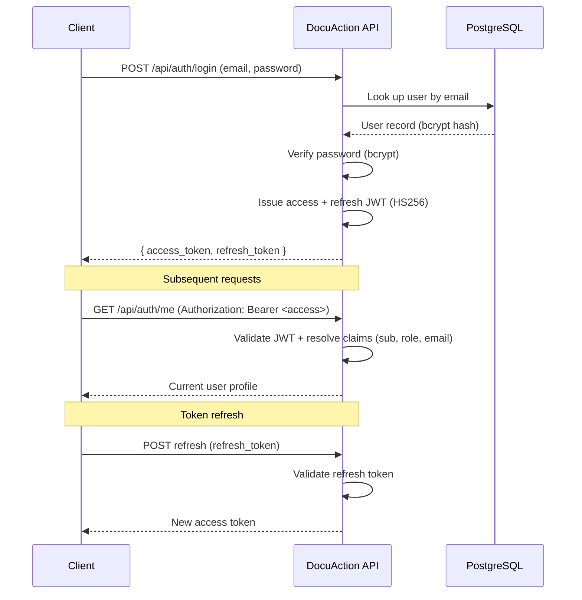
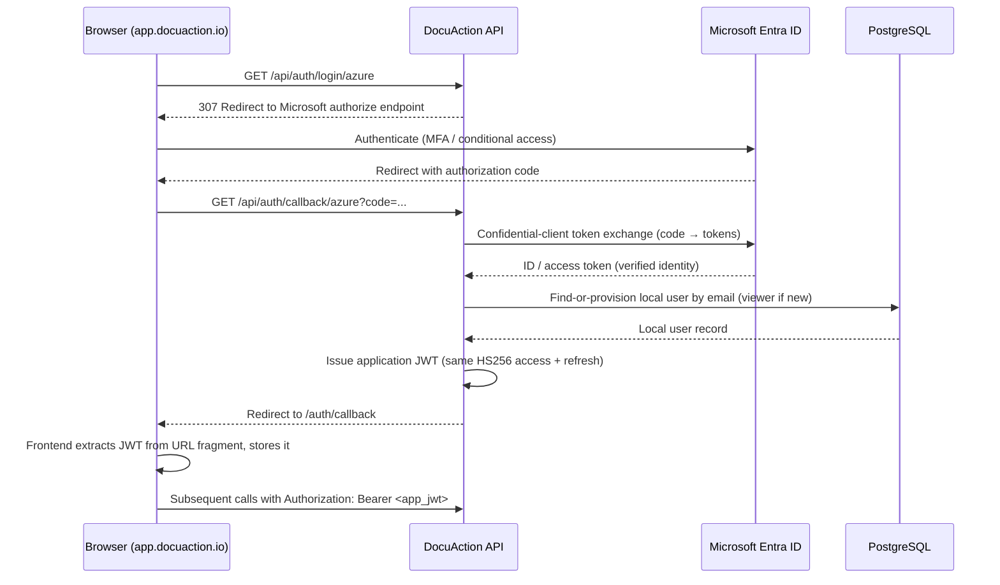

# DocuAction AI — Authentication & Authorization

**Alliance Global Tech, Inc. (AGT)** — Copyright © 2024–2026
**Product:** DocuAction AI — **Version 6.0.0**
**Base URL (production):** `https://api-prod.docuaction.io`
**Compliance frameworks:** NIST SP 800-53 · OWASP · HIPAA · Section 508

---

## 1. Overview

DocuAction AI supports two authentication paths that converge on a single
application token model:

1. **Password login** — email/password verified against bcrypt-hashed credentials.
2. **Microsoft Entra ID SSO** — OAuth2 authorization-code flow (confidential
   client).

Both paths issue the **same application JWT** (HS256, access + refresh), so all
downstream endpoints and RBAC enforcement treat the two identically. See
`../architecture/adr/ADR-004-jwt-authentication.md` and
`../architecture/adr/ADR-005-entra-id-sso.md`.

## 2. Token Model

- **Algorithm:** HS256 (python-jose 3.4.0).
- **Access token:** short-lived; presented on every request.
- **Refresh token:** longer-lived; exchanged for new access tokens.
- **Transport header:**

  ```
  Authorization: Bearer <access_token>
  ```

### Claims

| Claim | Description |
|-------|-------------|
| `sub` | Subject — the authenticated user identifier |
| `role` | RBAC level (see §4) |
| `email` | User email address |
| `exp` | Expiration timestamp |

Tokens can be **revoked** to terminate compromised sessions before natural expiry.

## 3. Password Authentication Flow



**Key endpoints**

| Endpoint | Purpose |
|----------|---------|
| `POST /api/auth/login` | Authenticate with email/password; returns access + refresh tokens |
| `GET /api/auth/me` | Return the authenticated user's profile from the bearer token |
| (refresh) | Exchange a valid refresh token for a new access token |

## 4. Role-Based Access Control (RBAC)

Authorization is enforced against an **8-level** role model. Each endpoint declares
the minimum role required; the `role` claim is checked on every authenticated
request.

| Level | Role |
|-------|------|
| 1 | `viewer` |
| 2 | `contributor` |
| 3 | `manager` |
| 4 | `reviewer` |
| 5 | `senior_analyst` |
| 6 | `qalead` |
| 7 | `program_manager` |
| 8 | `admin` |

TEFCA workflows additionally apply contract-defined roles per **HHSAR 352.204-71**
and **FAR 52.212-4**. New users provisioned via SSO default to **least privilege
(`viewer`)**; elevation is a deliberate administrative action (NIST SP 800-53 AC-6).

## 5. Microsoft Entra ID SSO Flow



**Key endpoints**

| Endpoint | Purpose |
|----------|---------|
| `GET /api/auth/login/azure` | Initiate SSO; `307` redirect to Microsoft authorize endpoint |
| `GET /api/auth/callback/azure` | Receive the authorization code; perform confidential-client token exchange; issue the application JWT |

**Handoff detail:** the application JWT is delivered to the frontend via **URL
fragment** to the `/auth/callback` route. The fragment is not transmitted to the
server on the redirect, and the frontend reads and stores the token client-side.

**Provisioning detail:** the **first SSO login provisions a local user, linked by
email, at least privilege (`viewer`)**. Existing users are matched by email so both
login paths resolve to the same account and RBAC context.

## 6. Security Notes

- All authentication traffic is TLS-encrypted at the Azure edge.
- Passwords are stored only as bcrypt hashes (passlib + bcrypt 4.0.1).
- The HS256 `SECRET_KEY` and the Entra confidential-client secret are sourced from
  the environment / Azure Key Vault and are **never committed** to source control.
- Access tokens are short-lived; revocation is available to invalidate sessions.
- Failed authentication and authorization decisions are audit-logged without
  exposing PHI/PII or secrets.

## 7. Related Documents

- `api-overview.md` — API surface, versioning, error envelope, rate limiting.
- `../architecture/adr/ADR-004-jwt-authentication.md` — JWT decision record.
- `../architecture/adr/ADR-005-entra-id-sso.md` — Entra ID SSO decision record.
- `../architecture/data-flow.md` — end-to-end request and data flow.
