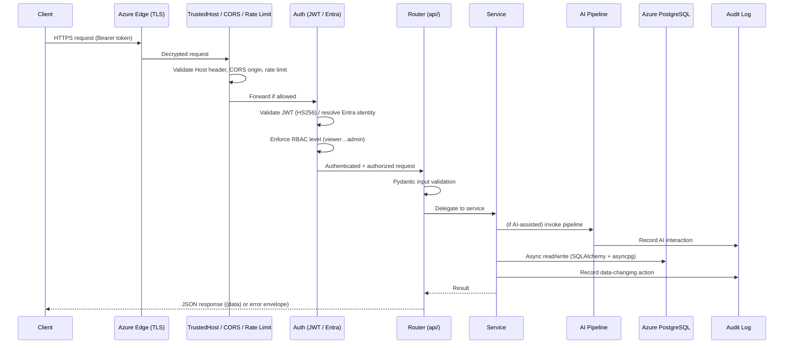
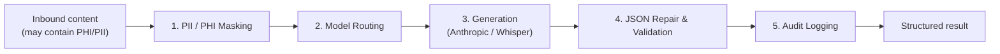
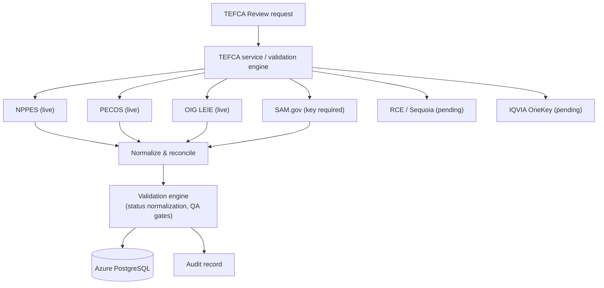
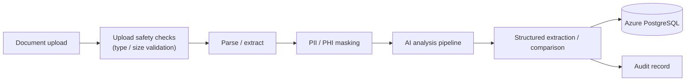

# DocuAction AI — Data Flow Architecture

**Alliance Global Tech, Inc. (AGT)** — Copyright © 2024–2026
**Product:** DocuAction AI — **Version 6.0.0**
**Compliance frameworks:** NIST SP 800-53 · OWASP · HIPAA · Section 508

---

## 1. Purpose

This document describes how data moves through the DocuAction AI backend — from an
inbound client request through security enforcement, business logic, the governed
AI pipeline, and persistence — with explicit attention to where PHI, PII, and CUI
are handled and where audit records are written.

## 2. Request Lifecycle (Primary Path)

### Stage-by-stage

1. **TLS edge** — Azure terminates TLS; all transport is encrypted.
2. **TrustedHost / CORS / Rate limiting** — `TrustedHostMiddleware` rejects
   unexpected `Host` headers (unlisted host → 400); strict CORS constrains browser
   origins; the global rate limiter throttles abusive callers.
3. **Authentication** — a JWT (HS256) issued by password login **or** Entra ID SSO
   is validated; the subject, role, and email claims are resolved. See
   `../api/authentication.md`.
4. **Authorization (RBAC)** — the caller's role is checked against the 8-level model
   (viewer→admin) and, for TEFCA workflows, contract-defined roles.
5. **Routing & validation** — the router validates the request body/params with
   Pydantic before any business logic executes.
6. **Service layer** — orchestrates business logic, connector calls, and (where
   applicable) the AI pipeline.
7. **Persistence** — services use the async SQLAlchemy engine (asyncpg) to read and
   write Azure PostgreSQL Flexible Server.
8. **Response** — a structured JSON response is returned. Errors use a consistent
   envelope: `{ "error": <message>, "code": <error_code>, "request_id": <id> }`.

## 3. AI Pipeline Data Flow

AI-assisted operations pass through a governed sequence designed for data
minimization and traceability:

1. **PII / PHI masking** — sensitive tokens are masked **before** any external model
   invocation, minimizing exposure of protected data to third-party AI services.
2. **Routing** — the request is directed to the appropriate model: Anthropic for
   generation and reasoning; OpenAI Whisper for audio transcription.
3. **Generation** — the model produces output.
4. **JSON repair & validation** — structured outputs are repaired and validated
   against the expected schema before use.
5. **Audit logging** — the interaction is recorded for traceability and compliance.

**PHI/PII handling point:** masking at stage 1 is the critical control that keeps
protected data from leaving the trust boundary in cleartext.

## 4. TEFCA Connector Data Flow

The TEFCA connector layer queries authoritative sources over `httpx`, normalizes
and reconciles the responses, and runs them through the validation engine (which
applies status normalization and QA gates) before persisting results and writing
an audit record. Connector data handling is governed by HHSAR 352.204-71 and
FAR 52.212-4.

## 5. Document Processing Flow

Uploaded documents are first validated for safety (type and size), parsed and
extracted, masked for PII/PHI, then processed through the AI pipeline for
extraction, comparison, or analysis. Results are persisted and audited.

## 6. Audit Logging

Data-changing actions and AI interactions produce audit records supporting
NIST SP 800-53 AU-family controls. Audit entries are written alongside the primary
transaction so that authentication events, authorization decisions, AI invocations,
connector queries, and record mutations are traceable. Audit content is subject to
the same PHI/PII minimization discipline as the rest of the system — sensitive
values are masked or referenced by identifier rather than stored in the clear.

## 7. PHI / PII / CUI Handling Summary

| Point in flow | Control |
|---------------|---------|
| Transport | TLS at Azure edge (encryption in transit) |
| Ingress | TrustedHost, CORS, rate limiting, upload safety checks |
| Identity | JWT (HS256) / Entra ID; RBAC least privilege |
| AI boundary | PII/PHI masking before any external model call |
| Persistence | Azure PostgreSQL Flexible Server; parameterized async queries |
| Error handling | Standardized envelope; no PHI/PII/secret leakage in errors or logs |
| Observability | Audit logging; Microsoft Defender for Cloud monitoring |

## 8. Related Documents

- `system-overview.md` — component architecture.
- `../api/api-overview.md` — API surface.
- `../api/authentication.md` — authentication and SSO sequences.
