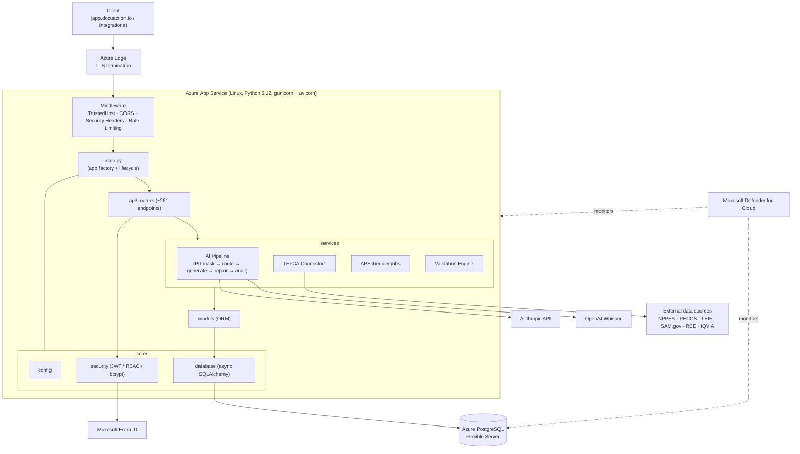

# DocuAction AI — System Architecture Overview

**Alliance Global Tech, Inc. (AGT)** — Copyright © 2024–2026
**Product:** DocuAction AI (healthcare/TEFCA suite: DocuAction TEFCA ARC) — **Version 6.0.0**
**Certifications:** CMMI Level 3 · ISO 27001 · ISO 9001
**Compliance frameworks:** NIST SP 800-53 · OWASP · HIPAA · Section 508

---

## 1. Purpose

This document describes the high-level architecture of the DocuAction AI backend
service. The backend is a layered, asynchronous FastAPI application that provides
document intelligence, audio transcription, healthcare claims processing, and the
DocuAction TEFCA ARC review protocol suite to federal and commercial healthcare
stakeholders. It processes Protected Health Information (PHI), Personally
Identifiable Information (PII), and Controlled Unclassified Information (CUI), and
is therefore engineered to federal security and compliance expectations.

## 2. Technology Stack

| Layer | Technology |
|-------|------------|
| Language / Runtime | Python 3.12 |
| Web framework | FastAPI 0.115.0 |
| ASGI server | Uvicorn 0.30.6 (managed by gunicorn workers) |
| ORM / DB driver | SQLAlchemy 2.0.35 (async) + asyncpg 0.29.0 |
| Migrations | Alembic 1.13.2 |
| Validation / schemas | Pydantic 2.9.2 |
| AuthN / tokens | python-jose 3.4.0 (JWT, HS256); passlib + bcrypt 4.0.1 |
| HTTP client | httpx 0.27.2 |
| AI SDK | Anthropic SDK 0.39.0 (with OpenAI Whisper for audio) |
| Scheduling | APScheduler 3.10.4 |
| Hosting | Azure App Service (Linux, Python 3.12, gunicorn + uvicorn) |
| Database | Azure Database for PostgreSQL Flexible Server |
| Identity | Microsoft Entra ID SSO + password login |
| Security posture | Microsoft Defender for Cloud (Standard) |

## 3. Layered Architecture

The application follows a strict layered separation of concerns:

1. **Application entrypoint (`main.py`)** — constructs the FastAPI app, installs
   middleware (TLS termination is handled at the Azure edge; `TrustedHost`, CORS,
   security headers, and global rate limiting are enforced in-process), registers
   routers, and wires startup/shutdown lifecycle hooks (including the APScheduler
   background scheduler).
2. **Core (`core/`)** — cross-cutting foundations: `config` (environment-driven
   settings), `database` (async SQLAlchemy engine and session management over
   Azure PostgreSQL), and `security` (password hashing, JWT issuance/validation,
   RBAC dependencies).
3. **API routers (`api/`)** — thin HTTP controllers grouped by module. Each router
   validates input via Pydantic, enforces authentication and RBAC, and delegates to
   services. Approximately **261 endpoints** are exposed under the `/api` prefix.
4. **Services** — business logic and orchestration, including the AI pipeline,
   TEFCA connector integrations, validation engine, and scheduled jobs.
5. **Models** — SQLAlchemy ORM entities mapped to the PostgreSQL schema and
   evolved through Alembic migrations.

## 4. Component Diagram

## 5. Module Inventory

The backend organizes functionality into the following modules, each surfaced
through dedicated routers and services:

- **Documents** — ingestion, parsing, and AI-assisted document intelligence.
- **Audio** — speech-to-text transcription (OpenAI Whisper) and downstream analysis.
- **Healthcare Claims** — claims intake, validation, and processing.
- **Data Systems** — structured data ingestion and system-of-record integration.
- **Comparison** — document and dataset comparison / diffing.
- **Extraction** — structured data extraction from unstructured sources.
- **Automation** — workflow automation and orchestration.
- **TEFCA Review Protocol** — DocuAction TEFCA ARC review workflows.
- **Case Management** — case lifecycle and assignment.
- **Bulletin Intelligence** — scheduled intelligence briefing generation and delivery.
- **Enterprise / Validation / Decision Intelligence / Export / Templates /
  Meetings / SLA / Plans** — supporting enterprise capabilities.

## 6. Connector Integrations (TEFCA)

The DocuAction TEFCA ARC suite integrates authoritative federal and industry data
sources through a connector layer:

| Connector | Status | Notes |
|-----------|--------|-------|
| NPPES | Live | National Provider registry |
| PECOS | Live | Medicare enrollment |
| OIG LEIE | Live | Exclusions list |
| SAM.gov | Key required | Requires registered API key |
| RCE / ONC | Pending | Integration in progress |
| IQVIA OneKey | Pending | Integration in progress |

Connector roles and data handling align with **HHSAR 352.204-71** and
**FAR 52.212-4** contractual requirements.

## 7. Background Processing

APScheduler runs in-process to execute recurring jobs, most notably the Bulletin
Intelligence briefing generation and delivery pipeline. Scheduler activation is
environment-gated so background execution can be enabled independently per
deployment. Scheduled jobs share the same async database engine, AI pipeline, and
audit-logging facilities as the request path.

## 8. AI Pipeline

AI-assisted operations flow through a governed pipeline that (1) masks PII/PHI
before any external model call, (2) routes the request to the appropriate model
(Anthropic for generation/reasoning; OpenAI Whisper for audio), (3) generates the
response, (4) repairs and validates structured JSON output, and (5) records an
audit entry. This design keeps sensitive data minimization and traceability at the
center of every AI interaction. See `data-flow.md` for the detailed sequence.

## 9. Hosting & Network Security

- **Compute:** Azure App Service (Linux) running Python 3.12 with gunicorn
  supervising uvicorn workers.
- **Transport:** TLS enforced at the Azure edge; all traffic to
  `api-prod.docuaction.io` is encrypted in transit.
- **Host allow-listing:** `TrustedHostMiddleware` rejects requests with
  unexpected `Host` headers.
- **Cross-origin policy:** Strict CORS restricts browser origins (e.g.
  `app.docuaction.io`).
- **Rate limiting:** A global rate limiter protects all endpoints against abuse.
- **Monitoring:** Microsoft Defender for Cloud (Standard) provides continuous
  cloud security posture management across App Service and PostgreSQL resources.

## 10. Related Documents

- `data-flow.md` — end-to-end request and data flow.
- `adr/ADR-001-azure-migration.md` — Railway → Azure migration decision.
- `adr/ADR-002-fastapi-framework.md` — web framework selection.
- `adr/ADR-003-postgresql-database.md` — database platform selection.
- `adr/ADR-004-jwt-authentication.md` — token-based authentication.
- `adr/ADR-005-entra-id-sso.md` — Entra ID single sign-on.
- `../api/api-overview.md` — API surface overview.
- `../api/authentication.md` — authentication flows.
