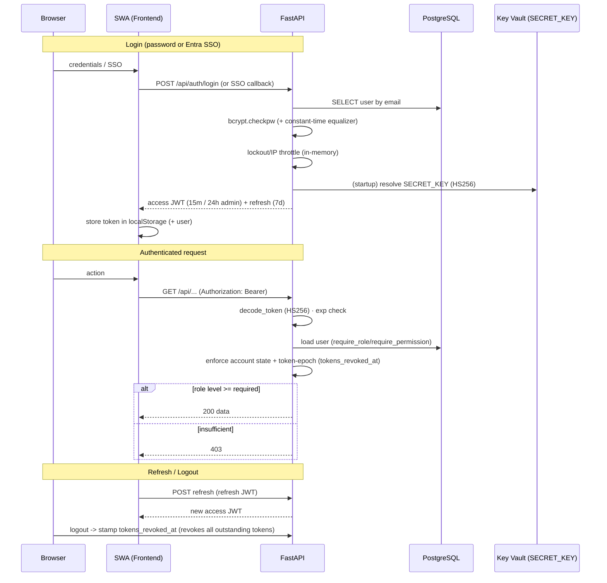

# Diagram 6 — Authentication Flow

```mermaid
sequenceDiagram
    participant U as Browser
    participant FE as SWA (Frontend)
    participant API as FastAPI
    participant DB as PostgreSQL
    participant KV as Key Vault (SECRET_KEY)

    Note over U,API: Login (password or Entra SSO)
    U->>FE: credentials / SSO
    FE->>API: POST /api/auth/login (or SSO callback)
    API->>DB: SELECT user by email
    API->>API: bcrypt.checkpw (+ constant-time equalizer)
    API->>API: lockout/IP throttle (in-memory) 
    API->>KV: (startup) resolve SECRET_KEY (HS256)
    API-->>FE: access JWT (15m / 24h admin) + refresh (7d)
    FE->>FE: store token in localStorage (+ user)

    Note over U,API: Authenticated request
    U->>FE: action
    FE->>API: GET /api/... (Authorization: Bearer)
    API->>API: decode_token (HS256) · exp check
    API->>DB: load user (require_role/require_permission)
    API->>API: enforce account state + token-epoch (tokens_revoked_at)
    alt role level >= required
        API-->>FE: 200 data
    else insufficient
        API-->>FE: 403
    end

    Note over U,API: Refresh / Logout
    FE->>API: POST refresh (refresh JWT)
    API-->>FE: new access JWT
    U->>API: logout -> stamp tokens_revoked_at (revokes all outstanding tokens)
```

**Caveats:** HS256 (symmetric secret) · JWT in localStorage (XSS risk) · lockout/throttle in-memory (per-process).
