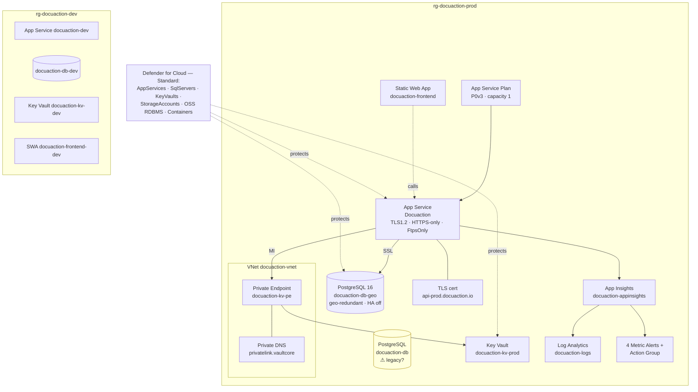

# Diagram 5 — Azure Infrastructure

**Strengths:** KV private endpoint, Defender Standard broad coverage, geo-redundant backups, monitoring+alerts. **Gaps:** capacity 1 / PG HA off (no HA), possible legacy `docuaction-db`, no WAF/Front Door.
