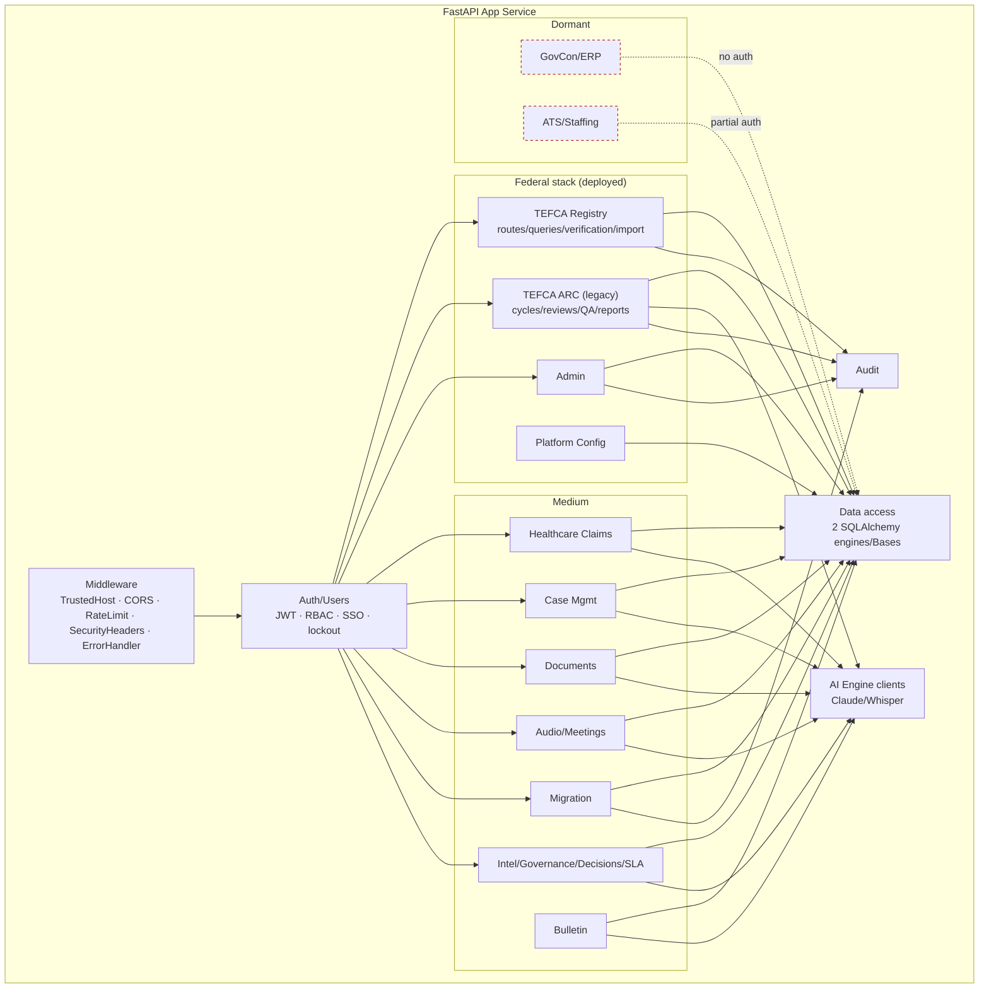

# C4 Level 3 — Components (inside the Backend API)

```mermaid
graph TB
    subgraph "FastAPI App Service"
        MW["Middleware<br/>TrustedHost · CORS · RateLimit · SecurityHeaders · ErrorHandler"]
        AUTHC["Auth/Users<br/>JWT · RBAC · SSO · lockout"]
        subgraph "Federal stack (deployed)"
            REGC["TEFCA Registry<br/>routes/queries/verification/import"]
            ARCC["TEFCA ARC (legacy)<br/>cycles/reviews/QA/reports"]
            PLATC["Platform Config"]
            ADMC["Admin"]
        end
        subgraph "Medium"
            BULC["Bulletin"]
            HCC["Healthcare Claims"]
            CMC["Case Mgmt"]
            DOCC["Documents"]
            AUDC["Audio/Meetings"]
            MIGC["Migration"]
            INTC["Intel/Governance/Decisions/SLA"]
        end
        subgraph "Dormant"
            GOVC["GovCon/ERP"]
            ATSC["ATS/Staffing"]
        end
        AIENG["AI Engine clients<br/>Claude/Whisper"]
        AUDIT["Audit"]
        DAL["Data access<br/>2 SQLAlchemy engines/Bases"]
    end

    MW --> AUTHC
    AUTHC --> REGC & ARCC & ADMC & HCC & CMC & DOCC & AUDC & MIGC & INTC
    REGC & ARCC & ADMC & HCC & CMC & DOCC & AUDC & MIGC & INTC & PLATC & BULC --> DAL
    ARCC & HCC & CMC & DOCC & AUDC & BULC & INTC --> AIENG
    REGC & ARCC & ADMC & MIGC --> AUDIT
    GOVC -. no auth .-> DAL
    ATSC -. partial auth .-> DAL

    classDef dormant stroke-dasharray:4 4,stroke:#a00;
    class GOVC,ATSC dormant;
```
