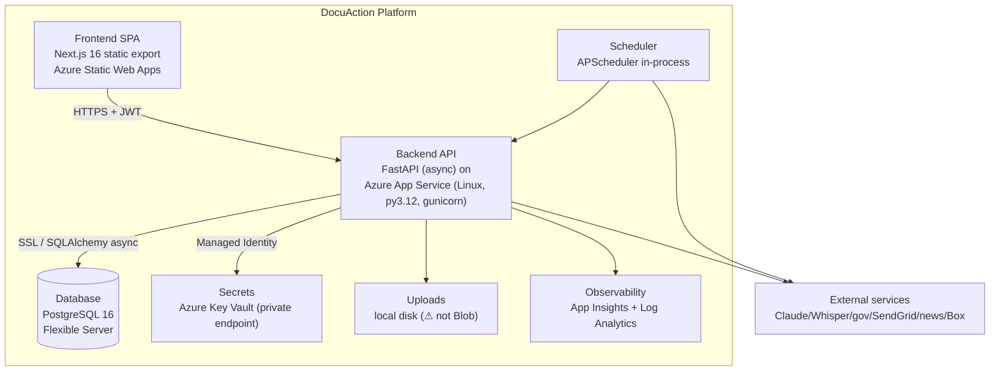

# C4 Level 2 — Containers

**Note:** two logical data models coexist inside the one API container (federal Base — deployed; commercial Base — dormant). Scheduler and uploads are in-process/local (single-instance constraints).
