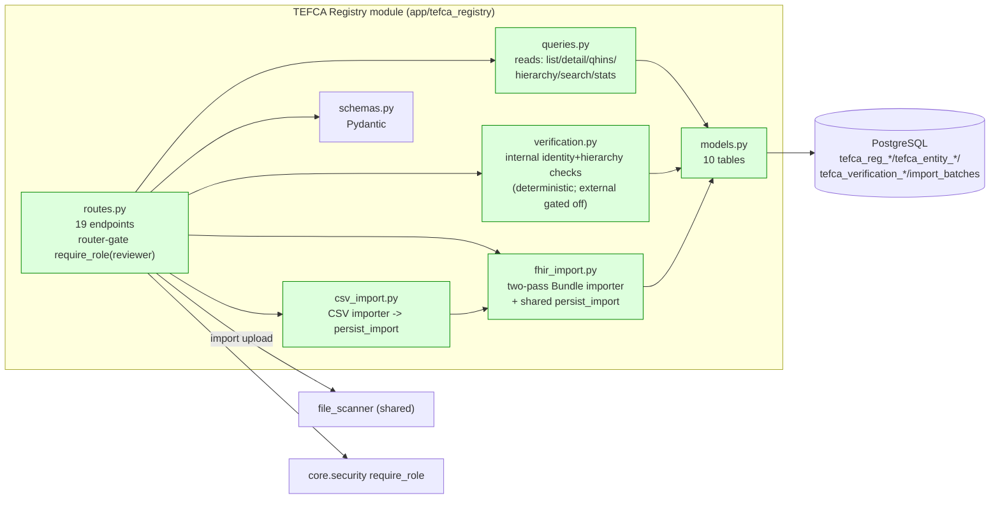

# C4 Level 4 — Component Detail: TEFCA Registry

**Data path — Reads:** Routes → Queries → Models → DB.
**Data path — Verify:** Routes → Verification (deterministic checks) → Models (jobs/checks/findings/audit) → DB.
**Data path — Import:** Routes → Scanner → FHIR/CSV Import → shared `persist_import` → Models (entities/identifiers/relationships/versions/audit/batch) → DB.

This module is the **reference implementation** for the codebase: isolated, RBAC-gated, indexed, audited, idempotent, fault-isolated.
