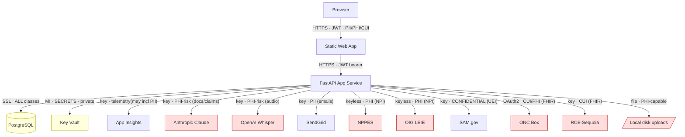

# Diagram 2 — Data Flow (with sensitivity labels)

**Legend:** red = PHI/PHI-capable path · yellow = secrets/all-data. All hops TLS-encrypted. **AI paths (Claude/Whisper) carry unminimized PHI risk — top data-flow finding.**
