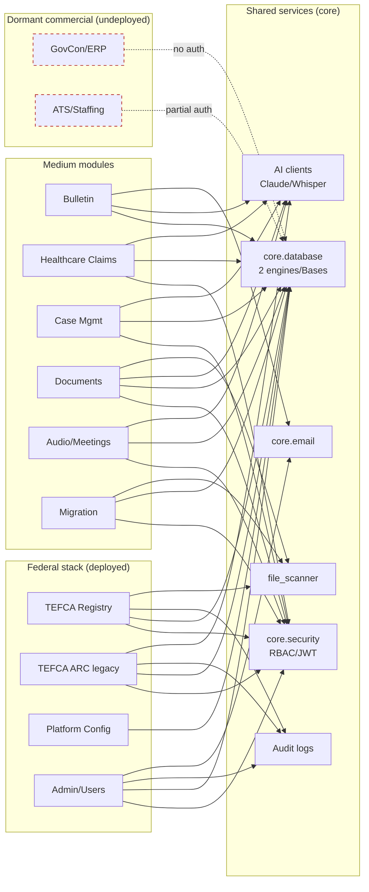

# Diagram 4 — Module Dependency Graph

Which modules depend on which shared services.

**Observations:** `core.database` (two engines/Bases) and `core.security` are the universal shared services. The **dormant commercial modules depend on the DB but bypass auth** (dashed red). AI clients are a widely-shared dependency (Part 2J).
