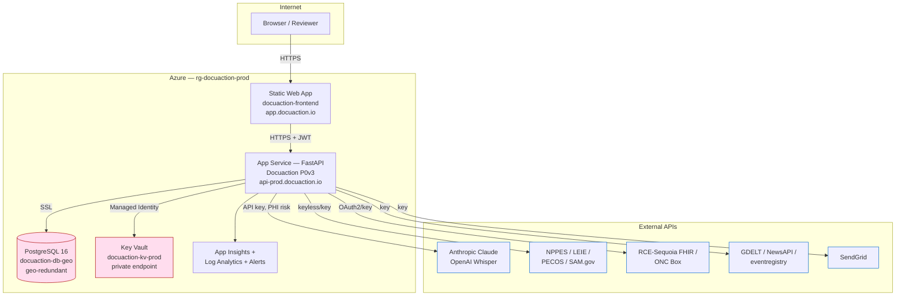

# Diagram 1 — High-Level System Architecture

**Notes:** single App Service instance (no HA); Key Vault is the only privately-networked dependency; PHI can flow to the LLM providers (compliance item).
