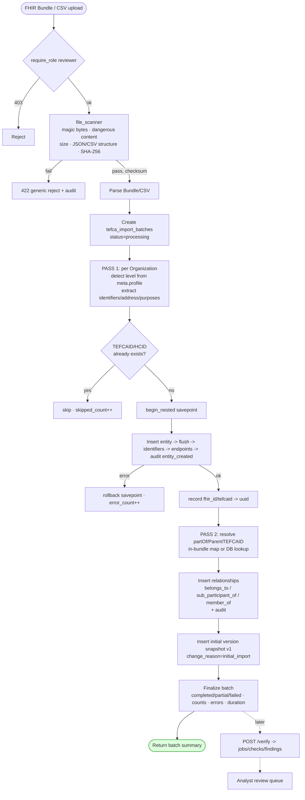

# Diagram 7 — TEFCA Entity Import Flow

**Design strengths:** two-pass (ordering-independent) · idempotent skip · per-entity savepoint fault isolation · full audit + versioning · reuses the platform upload scanner. *(ONC Box → download step is a planned source; current engine ingests uploaded Bundles/CSV.)*
