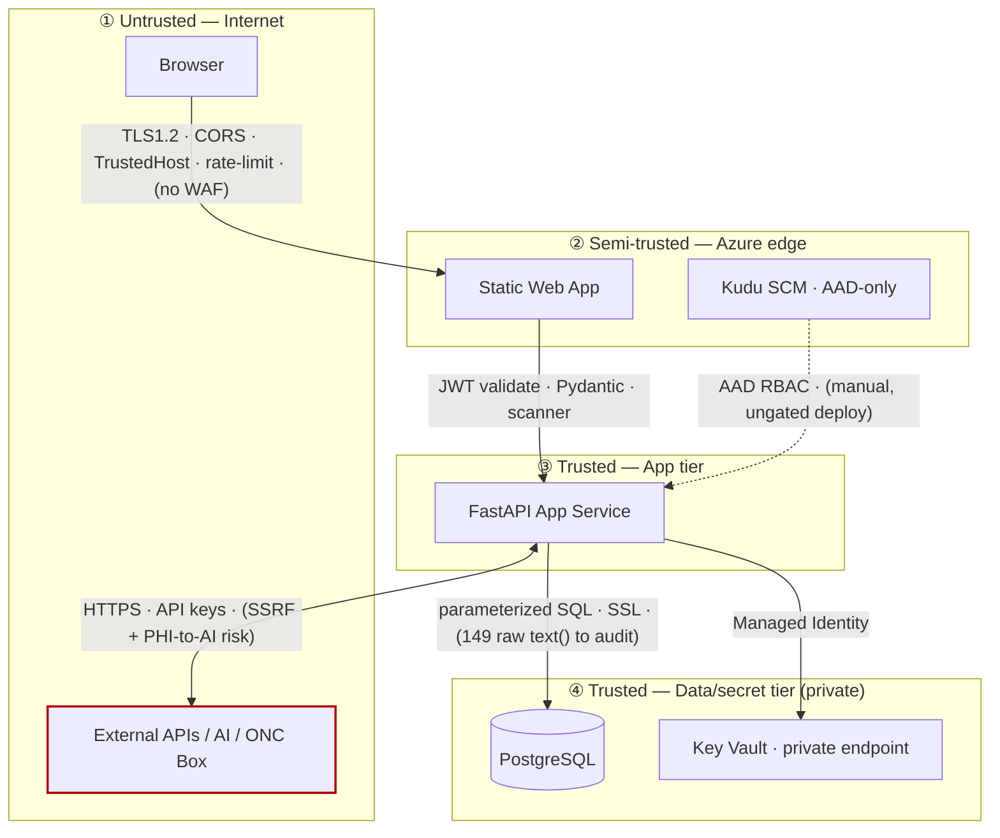

# Diagram 3 — Trust Boundaries

**Boundary posture:** ⑤ App→Azure = Strong (MI + private KV) · ① edge = Good (needs WAF) · ③ DB = Moderate (raw SQL + credential) · ④ External = Moderate/Weak (PHI-to-AI, SSRF) · Management = Moderate (AAD-only but manual deploy).
